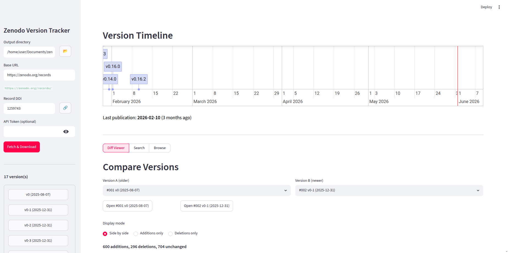

# zenodo-viewer



Tool to track and compare all versions of a Zenodo record. Downloads every version, extracts PDF/TeX files, converts PDFs to Markdown, and lets you diff and search across the full history.

## Install

```
uv tool install .
```

Or in a venv:

```
uv sync
```

## Usage

### Web UI (Streamlit)

```
zenodo_viewer
# or
zw
```

Features:
- Interactive timeline of all versions
- Side-by-side diff between any two versions
- Full-text search across all versions
- Browse converted content per version

### Workflow

1. **Output directory** — Set the local path where all downloaded files, converted text, and metadata will be stored. This is persisted between sessions. The folder structure is created automatically.

2. **Fetch & Download** — Enter any record ID or URL from the version history. The app resolves the `conceptrecid` (concept DOI) via the Zenodo API to discover all versions of that record, not just the one you pointed to. You don't need to find the "first" or "latest" — any version ID works as entry point.

### Processing

For each version, the app:

1. Downloads all attached files (PDF, archives, etc.)
2. Extracts ZIP/TAR archives
3. Recursively searches the extracted tree for `.pdf` and `.tex`/`.latex` files
4. Converts PDFs to Markdown using `pymupdf4llm` (or `marker-pdf` if enabled — better quality but requires PyTorch/GPU)
5. Copies TeX source files as-is into the `_text/` folder

The result is a `_text/` directory per version containing readable Markdown and TeX files, ready for diff and search. Already-downloaded versions are skipped (verified via MD5 checksum).

### CLI

```
python zenodo_versions.py https://zenodo.org/records/18437004
python zenodo_versions.py 18437004 -o my_folder --token MY_TOKEN
python zenodo_versions.py 18437004 --search "term1" "term2"
python zenodo_versions.py 18437004 --no-interactive --skip-download
```

Options:
- `-o, --output` — output directory (default: `zenodo_output`)
- `-t, --token` — Zenodo API token (higher rate limits)
- `--marker` — use marker-pdf for conversion (better quality, needs PyTorch + GPU)
- `--search` — terms to search across all versions
- `--skip-download` — use existing files, don't re-download
- `--no-interactive` — skip interactive CLI mode

## Dependencies

- Python >= 3.12
- requests, pymupdf, pymupdf4llm, streamlit, streamlit-vis-timeline

Optional: `marker-pdf` for higher quality PDF conversion.

## Output structure

```
<output_dir>/
  downloads/
    001_v1_12345/
      file.pdf
      _metadata.json
      _text/
        file.md
    002_v2_12346/
      ...
  diffs/
    index.html
    diff_001_v1_vs_002_v2_file.html
    ...
  versions.json
```

- **`downloads/`** — One subfolder per version containing the original files, metadata, and converted text (`_text/`).
- **`diffs/`** — HTML diff reports generated by the CLI (`python zenodo_versions.py`). Contains side-by-side diffs between consecutive versions, viewable in a browser via `index.html`. This is the offline equivalent of the "Diff Viewer" tab in the Streamlit app. Not generated by the web UI.
- **`versions.json`** — Cached API response with the list of all versions.
